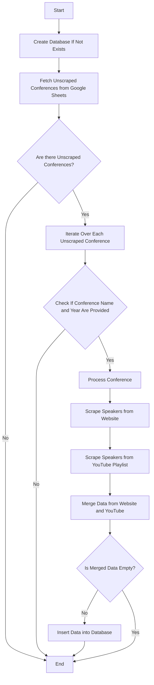
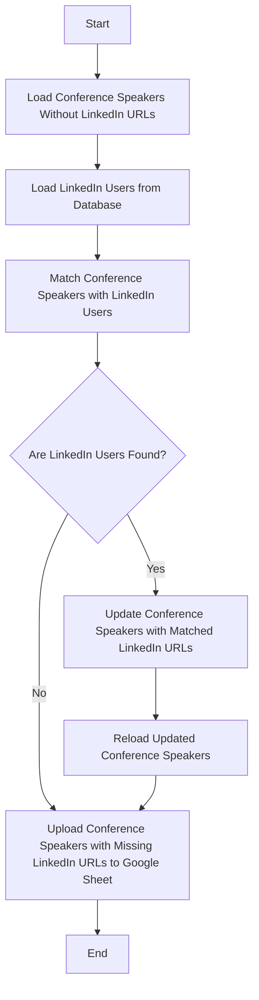
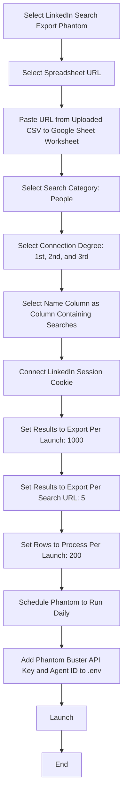
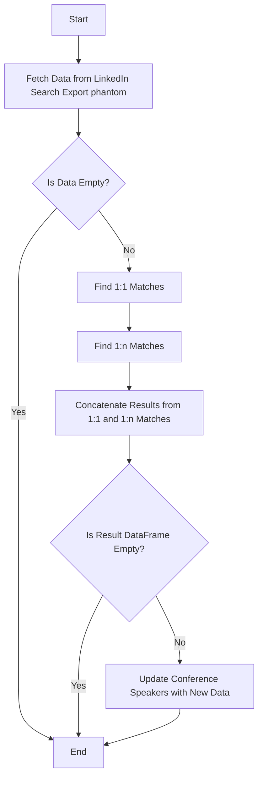
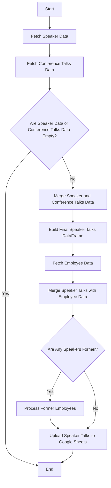
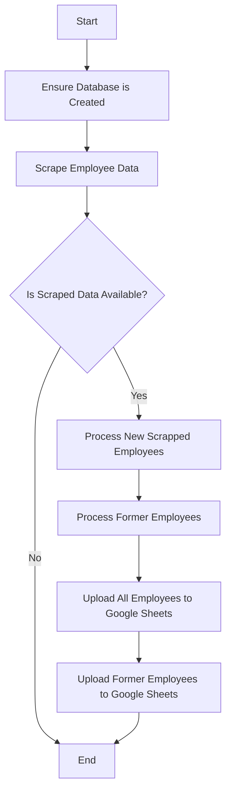

# Intelligence-Machine

## Conference Speakers Scraper

### Script 1: `conference_speakers_1.py`

This Python script automates the process of collecting, processing, and storing information on conference speakers from multiple online sources, including conference websites and YouTube playlists. The data is organized and stored in a PostgreSQL database for easy access and analysis.

#### Key Functions

1. **Identify Unscraped Conferences**  
   Cross-references conference data from Google Sheets and a local database to filter out already processed conferences.

2. **Scrape Speaker Information**  
   Gathers speaker data from two main sources:
   - **Conference Websites**: Scrapes information from speakers and agenda pages.
   - **YouTube Playlists**: Extracts titles and metadata from recorded conference videos.

3. **Merge and Store Data**  
   Combines the gathered data into a structured format for easy access and inserts it into a PostgreSQL database.

#### Requirements

- **Environment Setup**: Uses the `.env` file for environment variables, loaded via the `dotenv` library.

- **Google Sheets Setup**: In the Google Sheets file, columns must include:
  - **Conference Name** and **Conference Year** for uniquely identifying each conference.
  - **Speakers URL**: URL of the web page with the speakers listed. Use a hyphen `-` if unavailable.
  - **YouTube Playlist URL**: The YouTube playlist URL for recorded talks. Use a hyphen `-` if unavailable.
  
- **Data Scraping from Agenda Pages**: To effectively scrape speaker information from agenda pages, users must:
  - Provide screenshots of the agenda pages for each conference. 
  - Save these screenshots in the `Data/images/{conference_name}_{conference_year}` folder. The files should follow the naming format `{1..n}.png` (e.g., `1.png`, `2.png`, etc.). This helps to track talks of specific individuals and ensures accurate data extraction.

- **Database**: PostgreSQL should be installed and running with proper credentials configured within the script.

#### Flowchart for `Script 1: conference_speakers_1.py`

### Script 2: `conference_speakers_2.py`

This Python script automates the process of matching conference speakers with their corresponding LinkedIn profiles. It retrieves data from a PostgreSQL database, identifies speakers lacking LinkedIn URLs, and updates their information with matched LinkedIn URLs. Unmatched speakers are uploaded to a Google Sheet for further review and processing.

#### Key Functions

1. **Loading Conference Speakers**  
   - Retrieves a list of conference speakers who do not have associated LinkedIn URLs from the PostgreSQL database.

2. **Loading LinkedIn Users**  
   - Collects data on LinkedIn users, specifically focusing on employees of relevant companies, to find potential matches for the conference speakers.

3. **Matching Speakers with LinkedIn Profiles**  
   - Compares the normalized names of conference speakers with LinkedIn users to identify potential matches. The merging is performed on a cleaned version of names to ensure accurate matching, and only matches with valid LinkedIn URLs are retained.

4. **Updating Speaker Information**  
   - Updates the database with LinkedIn URLs for the matched speakers.

5. **Uploading Unmatched Speakers to Google Sheets**  
   - Any speakers that could not be matched with LinkedIn profiles are uploaded to a designated Google Sheets file for further processing. This Google Sheet will be used by the Phantom Buster Search Export tool, which will attempt to find corresponding LinkedIn URLs based on the speakers' names.

#### Requirements

- **Environment Setup**: Uses the `.env` file for environment variables, loaded via the `dotenv` library.

- **Database**: The PostgreSQL database should be set up and running, with the appropriate tables containing data for conference speakers and LinkedIn users.

- **Google Sheets**: The final output is uploaded to Google Sheets, requiring a configured API to handle data transfer.

#### Flowchart for `Script 2: conference_speakers_2.py`

#### Flowchart for Creating and Setting Up **Phantom Buster**

### Script 3: `conference_speakers_3.py`

This Python script is responsible for finding and updating LinkedIn URLs for conference speakers by leveraging data scraped from Phantom Buster's Search Export. It implements a dual approach to matching: identifying 1:1 matches (where one person has one LinkedIn URL) and 1:n matches (where multiple LinkedIn URLs exist for the same name). In cases of ambiguity, it uses OpenAI's API to determine the most appropriate LinkedIn URL.

#### Key Functions

1. **Fetching Data from Phantom Buster**  
   - Retrieves scraped data from the Phantom Buster Search Export. The data consists of user queries and their corresponding LinkedIn URLs.

2. **Identifying 1:1 Matches**  
   - Groups the fetched data by user query and identifies instances where a single query corresponds to exactly one LinkedIn URL. The matched records are compiled for further processing.

3. **Identifying 1:n Matches**  
   - For queries that result in multiple LinkedIn URLs, this function distinguishes between different connection degrees (1st, 2nd, 3rd). It prioritizes matches based on connection degree, and in the case of multiple matches, it utilizes the OpenAI API to select the most relevant LinkedIn URL.

4. **Updating Conference Speakers**  
   - Updates the conference speakers' database with the matched LinkedIn URLs. If matches are found, the corresponding records are updated in the PostgreSQL database.

#### Requirements

- **Environment Setup**: Uses the `.env` file for environment variables, loaded via the `dotenv` library.

- **Database**: A PostgreSQL database must be configured to store the conference speakers' information, including their names and LinkedIn URLs.

- **Phantom Buster Setup**: The script relies on the Phantom Buster Search Export tool for scraping user data.

- **OpenAI API**: Access to the OpenAI API is necessary for retrieving filtered LinkedIn profiles in scenarios with multiple potential matches.

#### Flowchart for `Script 3: conference_speakers_3.py`

  

### Script 4: `conference_speakers_4.py`

This Python script is designed to merge data about conference speakers with their respective talks, leveraging data from a database. It fetches speaker and talk information, matches them based on normalized names, aggregates the data, and produces a comprehensive table of speakers, including details on their talks and conferences. The final results are uploaded to Google Sheets for further analysis or sharing.

#### Key Functions

1. **Fetching Data from Database**  
   - Uses database utilities to retrieve data about conference speakers and their associated talks.
   - The speaker data includes their names, websites, LinkedIn profiles, and normalized names for matching. The talks data includes talk titles, conference names, and conference years.

2. **Database Integration**  
   - The script interacts with the database to access and manipulate speaker and conference information. It ensures accurate merging of speaker data with related talks.

3. **Data Aggregation**  
   - Merges the retrieved data, aligning talks with their respective speakers, while ensuring the uniqueness of each speaker's engagements. This aggregation is formatted to display detailed speaker profiles, showing the conferences they participated in along with the titles of their talks.

4. **Employee Data Enrichment**
   -  Adds employee data by merging speaker profiles with employee information fetched from an external source, such as LinkedIn profiles. It categorizes speakers into different groups based on certain attributes, such as those marked as "former" employees.

5. **Google Sheets Integration**  
   - After processing, the organized data is uploaded to Google Sheets for easy sharing and accessibility.

#### Requirements

- **Environment Setup**: Uses the `.env` file for environment variables, loaded via the `dotenv` library.

- **Database**: The script requires access to a database storing information about speakers and their talks. The database is accessed through SQLAlchemy.

- **Google Sheets**: The final output is uploaded to Google Sheets, requiring a configured API to handle data transfer.

#### Flowchart for `Script 4: conference_speakers_4.py`

## Company Employees Scraper

### Script 1: `company_employees.py`

This Python script is designed to scrape employee data for various companies and update the corresponding database and Google Sheets. It handles new employee data, processes former employees, and ensures that the employee-company associations are accurately maintained. The final result is uploaded to Google Sheets for easy access and sharing.

#### Key Functions

1. **Scraping Data**
   - The `CompanyEmployeesScraper` class is used to scrape employee data from LinkedIn or other sources.
   - The scraped data includes employee profiles, their associated companies, and the timestamps for when the data was collected.

2. **Processing New Scraped Employees**
   - This function processes the newly scraped employee data, updating existing employee-company associations in the database or inserting new records if no association exists.
   - The function checks whether each employee is still associated with the company and updates their status if necessary.
   - It inserts new records for employees, companies, and the associations between them when no prior data exists.

3. **Processing Former Employees**
   - This function handles updating the status of former employees who are no longer working with the company.
   - It fetches all employee-company associations and identifies employees who are no longer listed in the scraped data.
   - Their employment status is updated to "unemployed" in the database to reflect their departure from the company.
  
4. **Database Integration**
   - The script uses various utility functions to interact with the database, ensuring that the employee and company data is correctly inserted or updated.
   - It manages employee-company associations, inserting new records and updating the status of existing ones.

5. **Google Sheets Integration**
   - After processing the data, the script uploads both current and former employee data to Google Sheets, where it can be further analyzed or shared.
   - The data is uploaded to two separate sheets: one for current employees and one for former employees.

#### Requirements

- **Environment Setup**: Uses the `.env` file for environment variables, loaded via the `dotenv` library.
- **Database**: The script interacts with a database to store employee and company information, handling the creation of associations and updates to the status of employees.
- **Google Sheets**: The final output is uploaded to Google Sheets, requiring a configured API to handle data transfer.

#### Flowchart for `Script 1: company_employee.py`

